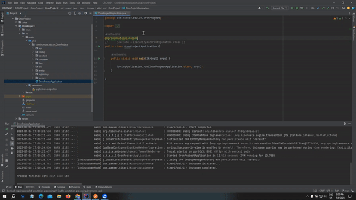
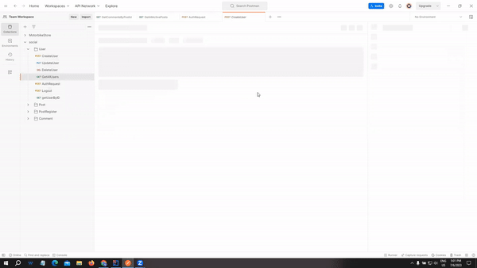
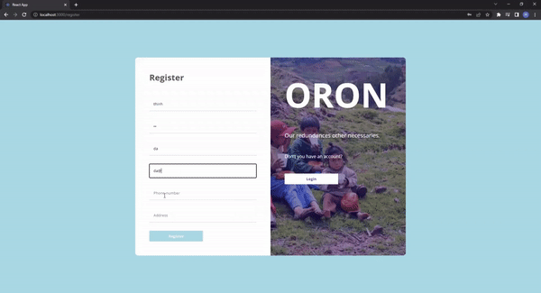
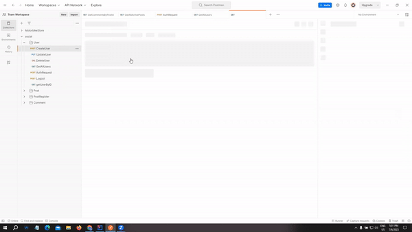
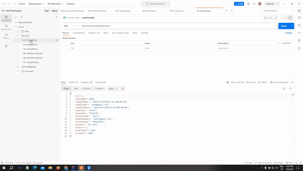
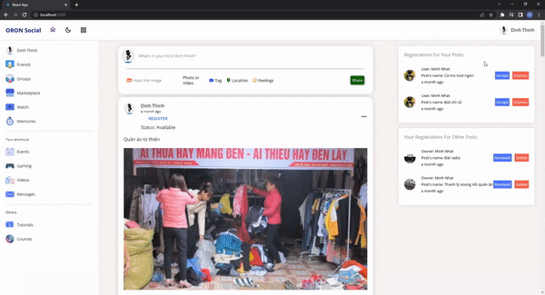
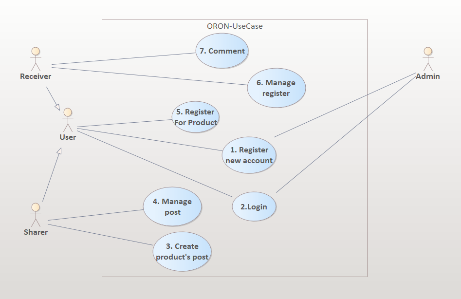

# [ORONAPI] CRUD Restful API for Social Media App Built With Java - Spring Boot - Hibernate - MySQL

## Introduction

Here is my source code for building Restful API of a social media app for users who want to share their redundant food or something, and then others can register to receive those things. 

  
  
  
   
  
  
  
   
  <i>Sample results</i>

## Motivation

 In Vietnam's daily life, I realized that there are many households with excess food that is not used up. Meanwhile, some people need that amount of food for their living, to make pet food for example. Moreover, it is the demand to give and take old things together. From that actual need, I decided to build a social media app dedicated to sharing utensils (food, items, ..) to make this sharing more efficient and convenient and called the application as ORON (Our Redundances Other Necessaries).

## Usecase diagram 

  <i>Usecase diagram</i> 
   
  <i>Link system analysis: https://docs.google.com/document/d/1diRNb74MNPIIrjgBVuJY4wnQwGYAeJEsLfGv4ZpVfOQ/edit</i> 

## Main functions: 
* **CRUD User**
* **Authentication/Authorization (Spring Security/ JWT Auth)**
* **CRUD Post**
* **CRUD PostRegister**
* **CRUD Comment**

## How to use my code

With my code, you can:
* **Clone project: git clone https://github.com/HdThinh6102git/OOADProject**
* **Open project in IntelliJ IDEA**
* **Run the file in the following path OronProject/OronProject/src/main/java/com/hcmute/edu/vn/OronProject/OronProjectApplication.java**
* **Test API with Postman**

## Requirements
* **Java 8.0**
* **Spring Boot 2.7.13**
* **Maven project**
* **Mysql 8.0**

## Acknowledgements
I express my sincere thanks to the teachers of HCMUTE and many online teachers on youtube (such as laptrinhjavaweb.com,...) who taught me lots of knowledge which I used to build this project.
